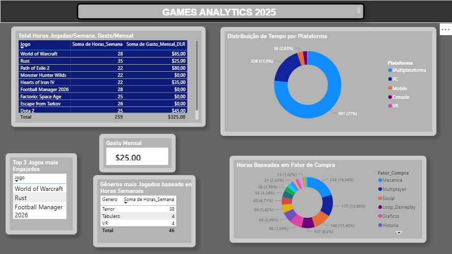

# 🎮 Pipeline de Dados & Analytics: Mercado de Games

Este projeto demonstra um pipeline de dados ponta a ponta focado no mercado de jogos. Ele engloba desde o tratamento de dados brutos e automação com **Python**, modelagem e persistência em banco de dados relacional com **SQL (SQLite)**, até a criação de um ecossistema visual de tomada de decisão utilizando **Power BI**.

---

## 🚀 Arquitetura do Projeto

O projeto foi dividido em três camadas principais estruturadas para garantir a integridade e a escalabilidade das análises:

1. **Tratamento & Padronização (Python):** Limpeza e mapeamento dinâmico de dados estruturados em planilhas para evitar inconsistências de nomenclatura.
2. **Engenharia & Modelagem de Dados (SQL/SQLite):** Criação de banco de dados relacional, aplicação de regras de negócio através de algoritmos de score/ranking baseados em engajamento e persistência automatizada.
3. **Analytics & BI (Power BI):** Construção de dashboards dinâmicos para identificação de padrões de consumo, correlações de mercado e métricas financeiras.

---

## 🛠️ Tecnologias e Ferramentas Utilizadas

*   **Linguagem:** Python 3.x
*   **Bibliotecas Python:** `pandas`, `sqlite3`
*   **Banco de Dados:** SQLite
*   **Visualização de Dados:** Power BI, Microsoft Excel
*   **Metodologias aplicadas:** Engenharia de Atributos (Feature Engineering), Normalização de Dados.

---

## 📂 Estrutura dos Scripts Python

A lógica de automação e engenharia foi modularizada nos seguintes arquivos dentro da pasta `/scripts`:

*   **`atualizar_excel.py`:** Automatiza a abertura do arquivo Excel via Pandas, identifica as colunas dinamicamente e realiza o mapeamento padronizado de categorias/plataformas para os jogos.
*   **`criar_banco.py`:** Script DDL responsável por estruturar o banco relacional, criando as tabelas `jogos` e `jogo_plataforma` com integridade referencial (Chaves Estrangeiras).
*   **`importar_e_ranquear.py`:** O motor de ETL. Ele lê a planilha, calcula um Score de Engajamento matemático baseado em pesos personalizados (Horas Semanais, Notas de Jogabilidade e Taxas de Conclusão), ordena o mercado e faz o *Upsert* (Insert or Replace) indexado no banco de dados.
*   **`ver_ranking.py`:** Uma CLI de visualização rápida. Realiza consultas SQL ordenadas diretamente no arquivo `.db` para exibir o TOP 10 do ranking calculado via terminal.

---

## 📊 O Dashboard (Power BI)

O painel visual foi conectado diretamente à base de dados tratada para responder a perguntas estratégicas de negócio, tais como:
*   Qual o perfil de idade média e nível de satisfação por gênero de jogo?
*   Qual o impacto do fator de compra (Ex: Loop de Gameplay, Gráficos, História) no gasto mensal em BRL?
*   Quais plataformas (PC, Console, Mobile, Multiplataforma) retêm mais horas de engajamento semanal?

---
## 🗺️ Próximas Implementações (Roadmap)

O projeto foi estruturado pensando em evoluções futuras. As próximas etapas planejadas são:

1.  **Interface de Linha de Comando (CLI) Avançada:** Melhorar o script de exibição para permitir que o usuário pesquise por jogos específicos ou filtre por plataforma direto no terminal.
2.  **Criação de uma API:** Utilizar frameworks web em Python (como o FastAPI) para transformar esse banco de dados em uma API que entrega o ranking de jogos em formato JSON.
3.  **Novas Métricas no Dashboard:** Adicionar análises de evolução temporal, mostrando quais anos tiveram os lançamentos mais engajados da indústria.

---
## ⚙️ Como Executar o Projeto

Abra o terminal no seu computador e execute os seguintes comandos, um por um:

1. Clonar o repositório:
git clone https://github.com/DenerL/analytics-games-industry.git

2. Entrar na pasta do projeto:
cd analytics-games-industry

3. Instalar as bibliotecas necessárias:
pip install pandas openpyxl

4. Executar o script que processa os dados e gera o ranking:
python scripts_python/importar_e_ranquear_jogos.py
